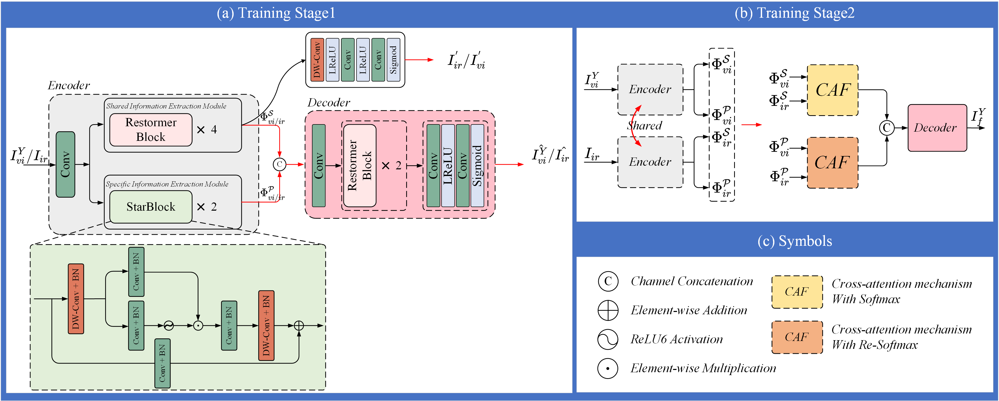

# FDFuse
## 🙌Introduction
* This is the official implementation of our paper titled "FDFuse: Infrared and Visible Image Fusion Based on Feature Decomposition". This paper has been accepted by IEEE Transactions on Instrumentation and Measurement (IEEE TIM).
* If you have any question about this code, feel free to reach me(cheng411523@163.com)

<!-- -[*[Paper]*](paper url)   -->

### ⚙ Network Architecture



### ⚙ Visualization


## 🏊Update
- [2025/03] Test code and config files are publicly available.


## 🌐Usage
* Ensure that the data and pre-trained weights are prepared and placed in the designated folder.
* Execute "test.py" to perform the testing.

## Citation
```
@article{cheng2025fdfuse,
  title={FDFuse: Infrared and Visible Image Fusion Based on Feature Decomposition},
  author={Cheng, Muhang and Huang, Haiyan and Liu, Xiangyu and Mo, Hongwei and Wu, Songling and Zhao, Xiongbo},
  journal={IEEE Transactions on Instrumentation and Measurement},
  year={2025},
  publisher={IEEE}
}
``` 

## 📖 Related Work
- Zhao Z, Bai H, Zhang J, et al. Cddfuse: Correlation-driven dual-branch feature decomposition for multi-modality image fusion[C]//Proceedings of the IEEE/CVF conference on computer vision and pattern recognition. 2023: 5906-5916.
- Li H, Wu X J. CrossFuse: A novel cross attention mechanism based infrared and visible image fusion approach[J]. Information Fusion, 2024, 103: 102147.

